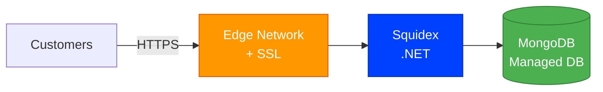
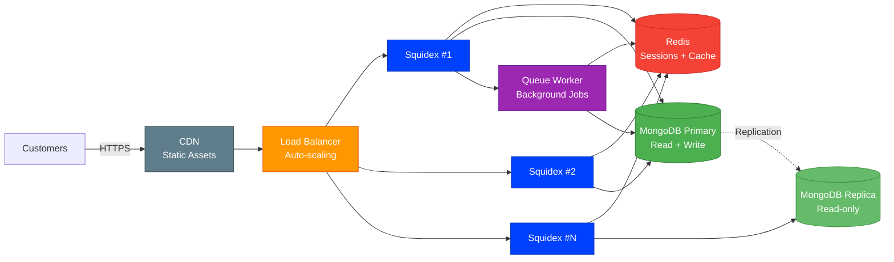

# Squidex    

A .NET headless CMS with event sourcing, CQRS, and a rich content modeling system. Provides GraphQL and REST APIs with real-time updates.

> **Credits**: Built on [Squidex](https://squidex.io) by [Sebastian Stehle](https://github.com/Squidex). All trademarks belong to their respective owners.

## Deploy on StackBlaze

This template includes a `stackblaze.yaml` for one-click deployment on [StackBlaze](https://stackblaze.com). Both options run on **Kubernetes** for reliability and scalability.

<strong>Standard Deployment</strong> — Single-instance Kubernetes setup for startups and moderate traffic

 

**What you get:**
- Single Squidex instance on Kubernetes
- Managed MongoDB database
- Automatic SSL/TLS via StackBlaze edge network
- Automated daily backups
- Zero-downtime deploys

**Best for:** Development, staging, and moderate-traffic production environments.

<strong>High Availability Deployment</strong> — Multi-instance Kubernetes setup for business-critical production

 

**What you get:**
- Auto-scaling Squidex pods on Kubernetes behind a load balancer
- Redis for shared sessions, cache, and queue management
- MongoDB primary + read replica for high throughput
- CDN for static assets (images, CSS, JS)
- Background queue workers for async processing
- Automated failover and self-healing
- Zero-downtime rolling deploys

**Best for:** Production workloads, high-traffic applications, business-critical deployments.

## Local Development

    docker compose up

Visit http://localhost:5000. Login: admin@example.com / password.

---

### Maintained by [StackBlaze](https://stackblaze.com)

Weekly automated checks for up-to-date dependencies, security scanning, and best practices.
